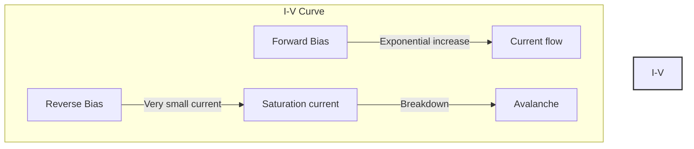
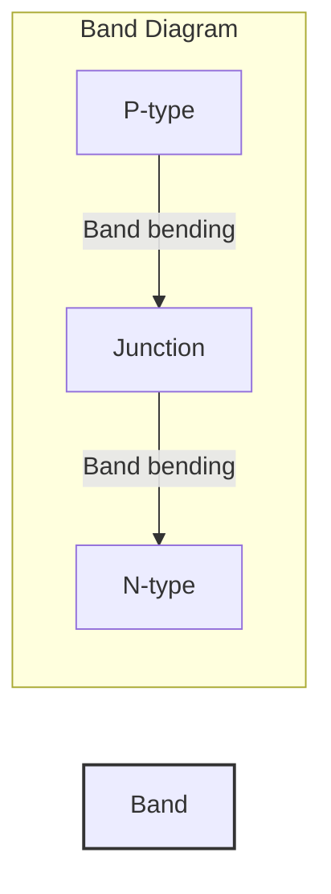
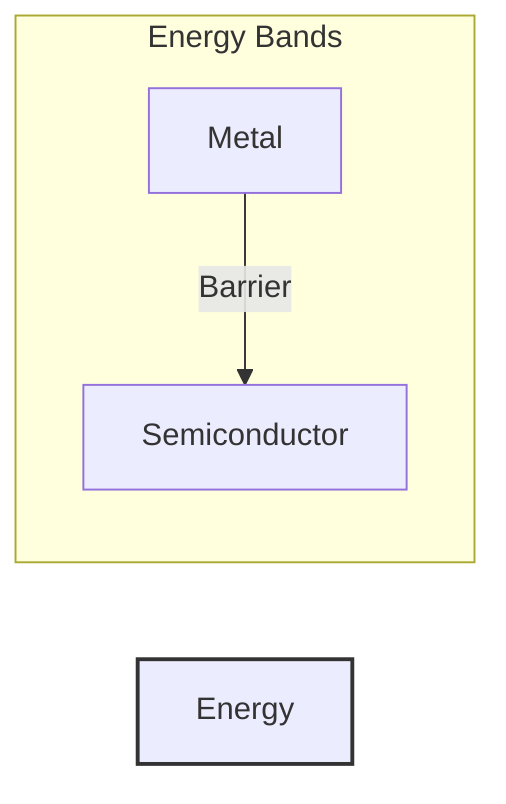
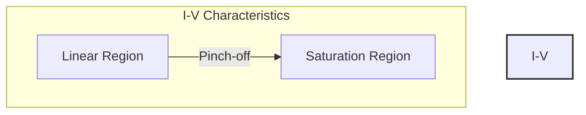
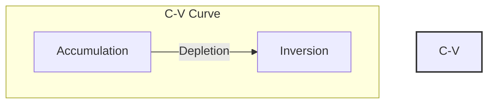

# Semiconductor Device Physics

## Table of Contents
1. [PN Junction](#pn-junction)
2. [Metal-Semiconductor Junction](#metal-semiconductor-junction)
3. [Junction Field Effect Transistor](#jfet)
4. [MOS Capacitor](#mos-capacitor)

# PN Junction

## Table of Contents
1. [Basic Concepts](#basic-concepts)
2. [Built-in Potential](#built-in-potential)
3. [Depletion Region](#depletion-region)
4. [Electric Field](#electric-field)
5. [Junction Capacitance](#junction-capacitance)
6. [Current Equations](#current-equations)

## Key Characteristics

### I-V Characteristic

### Energy Band Diagram

[Rest of PN Junction content as before...]

# Metal-Semiconductor Junction

### Band Diagram

[Rest of Metal-Semiconductor content as before...]

# JFET

### Characteristics

[Rest of JFET content as before...]

# MOS Capacitor

### C-V Characteristic

[Rest of MOS Capacitor content as before...]

## Notes on Diagrams:
- The diagrams are implemented using Mermaid graph syntax
- Each section includes relevant visual representations of key concepts
- Diagrams are integrated with the theoretical content for better understanding
- Interactive elements are preserved in the markdown format
